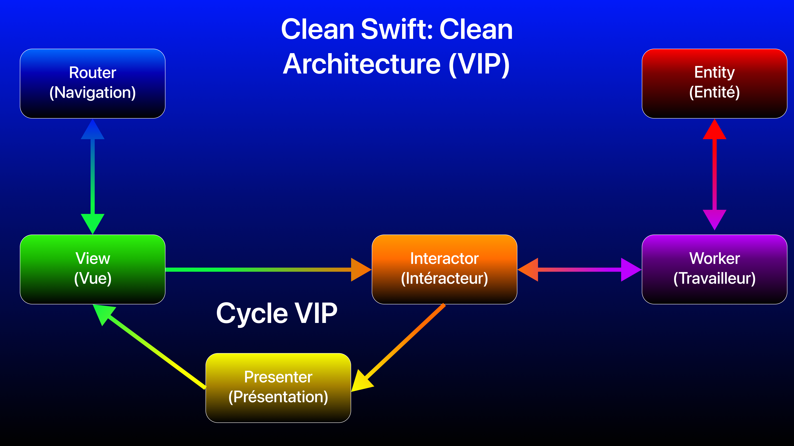
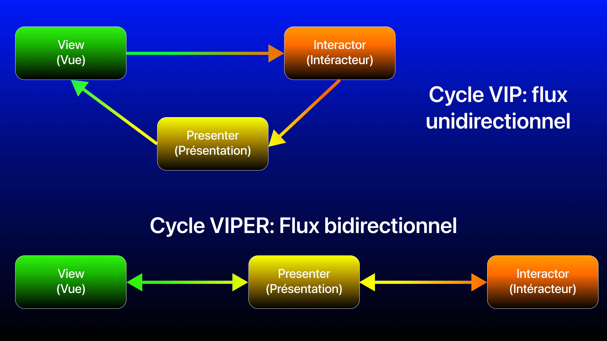
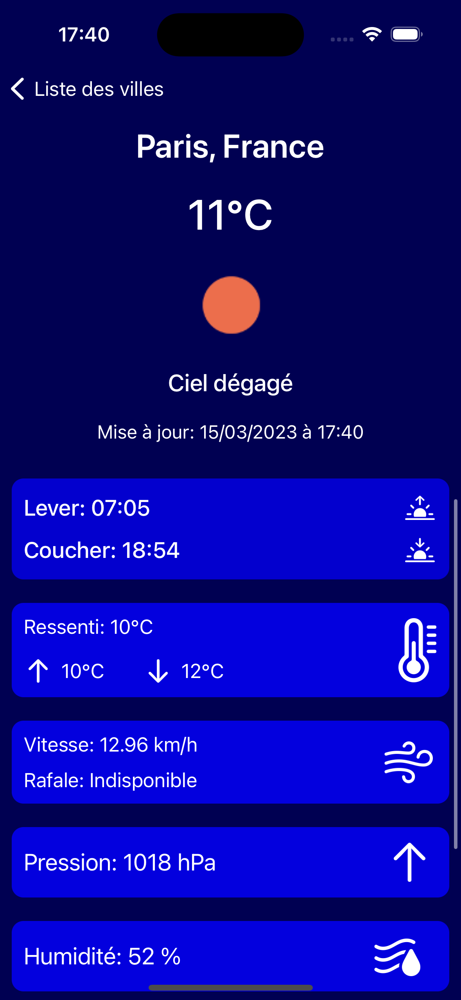

# Test technique iOS PSA (Stellantis): Application météo

Test technique officiel de Stellantis (PSA), réalisé par Koussaïla BEN MAMAR, le 15/03/2022

## Table des matières
- [Objectifs](#objectif)
    + [Réalisation d’une application Météo](#sujet)
    + [Instructions](#instructions)
    + [Contexte technique](#contexte)
    + [Contraintes](#contrainte)
- [Ma solution](#solution)
    + [Architecture](#architecture)
    + [Clean Architecture](#cleanarchitecture)
    + [Partie données (framework)](#datapart)
    + [Partie application (Clean Swift)](#cleanswift)
    + [Avantages et inconvénients](#avantages)
- [Choix techniques](#choices)
- [Guide d'utilisation de l'app](#userguide)
- [Conclusion](#conclusion)

## <a name="objectif"></a>Objectifs

Pour ce test technique, le délai est de 6 jours à compter de la réception du test.

### <a name="sujet"></a>Réalisation d’une application Météo

Votre mission si vous l’acceptez sera de réaliser une application Météo.

#### L’application sera décomposée en 2 modules:

**Une partie Composant (Framework):**
- Récupère les informations météo depuis une API 

**Une partie UI (Application):**
- Affiche les informations provenant du composant.

**L’application sera composée de 3 écrans:**
- Une liste affichant la liste des villes ajoutées par utilisateur
- Une vue pour ajouter une ville
- Une vue détail affichant les différentes informations météo
d’une ville

**Optionnellement vous pouvez:**
- Persister les données afin de pouvoir utiliser l’application offline
- Ajouter des Tests Unitaires pour votre Composant
- Ajouter des diagrammes de séquence pour votre
Composant
- Ajouter une documentation pour l’utilisation de votre
Composant

### <a name="instructions"></a>Instructions

L’application devra être déposée sur un repository Git public

Ce qui sera observé:
- La qualité du code
- L’architecture, les patterns utilisés
- La pertinence des commits
- Les optimisations diverses

Vous êtes libre de choisir le design qui vous paraît le plus pertinent.

### <a name="contexte"></a>Contexte technique

#### API

Utilisez l’API suivante pour les informations météo: https://openweathermap.org/api/one-call-api

L’utilisation de cette API nécessite une inscription.

### <a name="contrainte"></a>Contraintes

- Swift
- SDK Min 11 (iOS 13, 14 au minimum est toléré).
- L’utilisation des librairies externes à Apple est proscrite.

## <a name="solution"></a>Ma solution

Pour ce test technique de haut niveau, j'ai mis en place une **Clean Architecture**:

### <a name="architecture">Choix de l'architecture

Mettre en place une architecture appropriée est un vrai défi, le plus compliqué est de savoir les besoins liés au contexte actuel du projet:
- Maintenabilité
- Testabilité
- Temps et délais de développement
- Complexité de la logique métier
- Nombre d'écrans, de use cases
- Objectifs business

Ici, je mets donc en place une **Clean Architecture** découpée en 2 parties dans ce test technique. 

D'abord, il est important de savoir c'est qu'est la **Clean Architecture**.

### <a name="cleanarchitecture">Clean Architecture

La **Clean Architecture**, par Robert C. MARTIN (alias Uncle Bob), est un principe d'architecture permettant d'organiser et de séparer en couches les responsabilités. Ce principe est indépendant (certains diront **agnostique**) de toute technolgie et plateforme et aussi de toute architecture, en effet, on peut utiliser des architectures comme **MVVM**, **MVP**, **VIP**,... et les imbriquer dans une **Clean Architecture** en appliquant le principes des couches.

4 couches sont représentées dans le schéma ci-dessous par des cercles concentriques allant de l'extérieur vers l'intérieur, chacune ayant sa responsabilité:
- **Externe (UI ou base de données)**: La partie visuelle de l'application ou une base de données, en fonction de la plateforme et de l'application.
- **Présentation**: La partie qui reçoit les intéractions de l'utilisateur pour exécuter un use case précis (avec ou non des données en entrée) et aussi qui permet de mettre en place des données en sortie afin de notifier la couche externe de se mettre à jour avec ces nouvelles données.
- **Use case (cas d'utilisation)**: logique métier spécifique à un cas d'utilisation (appel réseau API REST, récupération de données d'une base de données pour une appli visuelle, synchronisation avec un service, ...)
- **Entités**: modèles de données définissant une logique bien précise. On appelle aussi cette couche, domaine.

Dans le cas d'une application iOS, 3 principales couches seront mises en place:
- **La couche de présentation (Presentation Layer):** La couche côté application content la partie **UI** et la partie présentation **(View Model, Presenter, Interactor, Router, Coordinator,...)** des architectures possibles **(MVVM, MVP, VIP, VIPER,...)**. Elle combine donc la couche externe et la couche présentation, et dépend exclusivement de la **couche domaine**.
- **La couche domaine (Domain Layer)**: La couche centrale de la **Clean Architecture** d'une application iOS, est la partie la plus interne de de la représentation des cercles concentriques, totalement isolée et ne dépendant pas des autres couches **(présentation et données)**. Cette couche est donc l'intermédiaire entre **les couches présentation et données**. La couche domaine regroupe les **entités de logique métier**, les **use cases** et les **interfaces (comme les répertoires, qu'on nomme aussi Repository)**. Ces entités communes faisant l'intermédiaire entre la couche de présentation et la couche de données se nomment les **objets de transfert de données (DTO: Data Transfer Object)**.
- **La couche de données (Data Layer):** La couche contenant les interfaces (Repository) et les sources de données locales (bases de données persistantes) et/ou à distance (API REST). C'est aussi ici que le décodage des données depuis le JSON est géré. Elle combine donc la couche externe (base de données, réseau) et la couche présentation (interface), et dépend exclusivement de la **couche domaine**.

<br>

Grâce à cette organisation en couches, la **Clean Architecture** assure l'indépendance, garantissant un code flexible étant:
- **Indépendant des frameworks**: les frameworks et librairies tierces doivent être pensés comme des outils, et non des cadres contraignants.
- **Testable indépendamment**: les tests doivent pouvoir être réalisés sans dépendances entre les parties, et sans dépendances à des éléments externes (API, base de données, …).
- **Indépendante de l’interface utilisateur**: l’interface utilisateur doit pouvoir évoluer facilement.
- **Indépendante de la base de données.**
- **Indépendante de tout service ou système externe**: en résumé, le code doit être indépendant des tierces parties dont il n’assure pas le contrôle.

Concernant la relation entre couches, seule une couche extérieure (supérieure) peut dépendre d'une couche intérieure (inférieure), et non l'inverse. De plus chaque couche étant indépendante, la dépendance se fait par le biais d'abstraction, et non de concret. Le dernier principe du **SOLID** s'applique alors, étant l'**inversion de dépendances (D: Depency Inversion)**. Cette architecture permet de s’assurer que les changements apportés sur les couches supérieures n’aient aucun impact sur les couches inférieures, et donc de maintenir une application stable aussi bien au cours de mises à jour de ressources externes, que de tests ou d’évolutions (changement de frameworks, de base de données, etc.).

La **Clean Architecture** va donc faciliter la maintenance et la testabilité du code (adaptée pour la mise en place du **TDD: Test Driven Development**).

### <a name="datapart">Partie données

Pour mettre en place la couche de données, un framework externe `MeteoWeatherData` est mis en place contenant les méthodes pour récupérer les informations météo depuis l'API et pour la persistance des données locales avec Core Data. Un repository est mis en place pour l'interface entre la partie app et data.

Voici ci-dessous le repository pour les différents cas d'utilisation, étant exploité par la couche domaine.
```swift
public protocol MeteoWeatherDataRepositoryProtocol: AnyObject {
    func searchCity(with query: String, completion: @escaping (Result<[GeocodedCity], MeteoWeatherDataError>) -> ())
    func addCity(with geocodedCity: GeocodedCity, completion: @escaping (Result<CityCurrentWeatherLocalEntity, MeteoWeatherDataError>) -> ())
    func fetchAllCities(completion: @escaping (Result<[CityCurrentWeatherLocalEntity], MeteoWeatherDataError>) -> ())
    func deleteCity(with name: String, completion: @escaping (Result<Void, MeteoWeatherDataError>) -> ())
}
```

La source de données locales pour la persistance de données complexes, indépendante si on veut par exemple passer de Core Data à Realm:
```swift
public protocol MeteoWeatherLocalService {    
    /// Saves the downloaded data of the location into a local database.
    /// - Parameters:
    ///   - geocodedCity: The object of the retrieved city from OpenWeather Geocoding API
    ///   - currentWeather: The object of the retrieved city from OpenWeather Current weather data API
    ///   - completion: Closure to handle the result with saved entity if saving to the local database has succeeded, or an error if saving to the local database has failed.
    func saveCityWeatherData(geocodedCity: GeocodedCity, currentWeather: CityCurrentWeather, completion: @escaping (Result<CityCurrentWeatherLocalEntity, MeteoWeatherDataError>) -> ())
    
    /// Retrieves all locations current weather data saved in the local database
    /// - Parameter completion: Closure to handle the result with retrived saved entities if succeeded, or an error if failed.
    func fetchAllCities(completion: @escaping (Result<[CityCurrentWeatherLocalEntity], MeteoWeatherDataError>) -> ())
    
    /// Delete a saved entity from the local database.
    /// - Parameters:
    ///   - city: The entity with full weather data to delete,
    ///   - completion: Closure to handle the result with if deletion has succeeded, or an error if failed.
    func deleteCity(cityName: String, completion: @escaping (Result<Void, MeteoWeatherDataError>) -> ())
}
```

La source de données à distance, en réseau, indépendante pour utiliser soit des API REST, ou des services en ligne comme Firebase:
```swift
/// The interface to use as abstraction for networking part, handling the API calls to OpenWeather API. Support with new Swift Concurrency (`async` / `await) and classic one with completion handler.
public protocol MeteoWeatherDataAPIService {
    /// Retrieves the geocoded city with name, country and GPS position. This method supports Swift Concurrency to be used in an `async` task (`Task`).
    /// - Parameter query: the name of location to search
    /// - Returns: The result of the fetch operation. An object of the retrieved geocoded city from OpenWeatherAPI Geocoding API if it has succeeded, an error if it fails.
    func fetchGeocodedCity(query: String) async -> Result<[GeocodedCity], MeteoWeatherDataError>
    
    /// Retrieves the full current weather of a city. This method supports Swift Concurrency to be used in an `async` task (`Task`).
    /// - Parameters:
    ///   - lat: Geographical coordinates of the found location (latitude)
    ///   - lon: Geographical coordinates of the found location (longitude)
    /// - Returns: The result of the fetch operation. An object of the retrieved city current weather from OpenWeatherAPI Geocoding API if it has succeeded, an error if it fails.
    func fetchCurrentCityWeather(lat: Double, lon: Double) async -> Result<CityCurrentWeather, MeteoWeatherDataError>
    
    /// Retrieves the geocoded city with name, country and GPS position.
    /// - Parameter query: the name of location to search
    /// - Parameter completion: Closure to handle the result with the decoded object of the retrieved geocoded city from OpenWeather Geocoding data API if operation has succeeded, or an error if the operation have failed.
    func fetchGeocodedCity(query: String, completion: @escaping (Result<[GeocodedCity], MeteoWeatherDataError>) -> ())
    
    
    /// Retrieves the full current weather of a city.
    /// - Parameters:
    ///   - lat: Geographical coordinates of the found location (latitude)
    ///   - lon: Geographical coordinates of the found location (longitude)
    /// - Returns: The result of the fetch operation. An object of the retrieved city current weather from OpenWeather Current weather data API if it has succeeded, an error if it fails.
    func fetchCurrentCityWeather(lat: Double, lon: Double, completion: @escaping (Result<CityCurrentWeather, MeteoWeatherDataError>) -> ())
}
```

Pour assurer une pleine indépendance entre la partie framework et la partie app, 2 objets de transfert de données **(DTO: Data Transfer Object)** sont mis en place en tant qu'intermédiaires entre les couches domaine et data. Ils permettent la mise en place de vues modèles pour la présentation.

Ce **DTO** représente les **use cases** de la la liste des villes et de la vue détaillée avec sa position et ses détails (nom, état/région, pays). Utilisé aussi pour le téléchargement et la sauvegarde des données détaillées de météo.
```swift
struct CityCurrentWeatherOutput {
    let name: String
    let country: String
    let weatherIcon: String
    let weatherDescription: String
    let temperature: Double
    let feelsLike: Double
    let tempMin: Double
    let tempMax: Double
    let lon: Double
    let lat: Double
    let sunset: Int
    let sunrise: Int
    let pressure: Int
    let humidity: Int
    let cloudiness: Int
    let windSpeed: Double
    let windGust: Double
    let oneHourRain: Double
    let oneHourSnow: Double
    let lastUpdateTime: Int
    
    init(with city: CityCurrentWeatherEntity) {
        self.name = city.name ?? "Ville inconnue"
        self.country = city.country ?? ""
        self.weatherIcon = city.weatherIcon ?? ""
        self.weatherDescription = city.weatherDescription ?? "Aucune description"
        self.temperature = city.temperature
        self.feelsLike = city.feelsLike
        self.tempMin = city.tempMin
        self.tempMax = city.tempMax
        self.lon = city.lon
        self.lat = city.lat
        self.sunset = Int(city.sunset)
        self.sunrise = Int(city.sunrise)
        self.pressure = Int(city.pressure)
        self.humidity = Int(city.humidity)
        self.cloudiness = Int(city.cloudiness)
        self.windSpeed = city.windSpeed
        self.windGust = city.windGust
        self.oneHourRain = city.oneHourRain
        self.oneHourSnow = city.oneHourSnow
        self.lastUpdateTime = Int(city.lastUpdateTime)
    }
    
    init(with city: CityCurrentWeatherLocalEntity) {
        self.name = city.name
        self.country = city.country
        self.weatherIcon = city.weatherIcon
        self.weatherDescription = city.weatherDescription
        self.temperature = city.temperature
        self.feelsLike = city.feelsLike
        self.tempMin = city.tempMin
        self.tempMax = city.tempMax
        self.lon = city.lon
        self.lat = city.lat
        self.sunset = Int(city.sunset)
        self.sunrise = Int(city.sunrise)
        self.pressure = Int(city.pressure)
        self.humidity = Int(city.humidity)
        self.cloudiness = Int(city.cloudiness)
        self.windSpeed = city.windSpeed
        self.windGust = city.windGust
        self.oneHourRain = city.oneHourRain
        self.oneHourSnow = city.oneHourSnow
        self.lastUpdateTime = Int(city.lastUpdateTime)
    }
    
    init(name: String, country: String, weatherIcon: String, weatherDescription: String, temperature: Double, feelsLike: Double, tempMin: Double, tempMax: Double, lon: Double, lat: Double, sunset: Int, sunrise: Int, pressure: Int, humidity: Int, cloudiness: Int, windSpeed: Double, windGust: Double, oneHourRain: Double, oneHourSnow: Double, lastUpdateTime: Int) {
        self.name = name
        self.country = country
        self.weatherIcon = weatherIcon
        self.weatherDescription = weatherDescription
        self.temperature = temperature
        self.feelsLike = feelsLike
        self.tempMin = tempMin
        self.tempMax = tempMax
        self.lon = lon
        self.lat = lat
        self.sunset = sunset
        self.sunrise = sunrise
        self.pressure = pressure
        self.humidity = humidity
        self.cloudiness = cloudiness
        self.windSpeed = windSpeed
        self.windGust = windGust
        self.oneHourRain = oneHourRain
        self.oneHourSnow = oneHourSnow
        self.lastUpdateTime = lastUpdateTime
    }
    
    func getCityViewModel() -> ListEntity.ViewModel.CityViewModel {
        return ListEntity.ViewModel.CityViewModel(
            name: self.name,
            weatherDescription: self.weatherDescription.prefix(1).capitalized + self.weatherDescription.dropFirst().lowercased() ,
            iconImage: self.weatherIcon,
            temperature: parseTemperature(with: self.temperature),
            minTemperature: self.tempMin != -999 ? parseTemperature(with: self.tempMin) : nil,
            maxTemperature: self.tempMax != -999 ? parseTemperature(with: self.tempMax) : nil
        )
    }
}
```

Ce **DTO** représente le **use case** de la recherche d'une ville avec sa position et ses détails (nom, état/région, pays). Utilisé aussi pour le téléchargement et la sauvegarde des données détaillées de météo.
```swift
struct CitySearchOutput {
    let name: String
    let localNames: [String: String]?
    let lat, lon: Double
    let country: String
    let state: String?
    
    init(with geocodedCity: GeocodedCity) {
        self.name = geocodedCity.name
        self.localNames = geocodedCity.localNames
        self.lat = geocodedCity.lat
        self.lon = geocodedCity.lon
        self.country = countryName(countryCode: geocodedCity.country) ?? geocodedCity.country
        self.state = geocodedCity.state
    }
    
    init(name: String, localNames: [String : String]? = nil, lat: Double, lon: Double, country: String, state: String? = nil) {
        self.name = name
        self.localNames = localNames
        self.lat = lat
        self.lon = lon
        self.country = country
        self.state = state
    }
    
    func getCityViewModel() -> AddEntity.ViewModel.CityViewModel {
        return AddEntity.ViewModel.CityViewModel(
            name: self.getCityFullName()
        )
    }
    
    func getGeocodedCity() -> GeocodedCity {
        return GeocodedCity(
            name: self.name,
            localNames: self.localNames,
            lat: self.lat,
            lon: self.lon,
            country: self.country,
            state: self.state
        )
    }
    
    private func getCityFullName() -> String {
        var place = localNames?["fr"] ?? name
        
        if let state {
            place += ", \(state)"
        }
        
        place += ", \(country)"
        return place
    }
}
```

### <a name="cleanswift">Partie app avec Clean Swift, la variante VIP de la Clean Architecture sur iOS

En iOS avec Swift, il y a plusieurs possibilités pour implémenter une application avec une **Clean Architecture**. Les plus populaires sont celles avec une base **MVVM** et **VIP** pour les couches vue et présentation. Tout dépendra aussi des designs patterns qui seront utilisés **(Repository, Factory, Router, Coordinator,...)**

Ici, nous allons donc nous intéresser à l'implémentation de la variante **VIP**, étant aussi utilisé pour le modèle **Clean Swift**, très populaire dans le développement iOS.

**Clean Swift** n'est pas un framework, c'est un ensemble de templates pour implémenter les composants de la **Clean Architecture** avec **VIP** (**View Interactor Presenter**). Ce concept architectural a été créé par Raymond Law en 2015.

Cette architecture particulière se compose en **scènes** représentant chacun un **use case** (cas d'utilisation). Chaque module se compose de 6 éléments (2 optionnels):
- La **vue (View)** représente l'UI (interface graphique) et les interactions utilisateurs (appui sur un bouton, saisie de texte, ...). La vue a une relation avec l'intéracteur et le routeur. Elle représente donc ici la couche externe de la **Clean Architecture**.
- L'**intéracteur (Interactor)** représente le traitement des actions utilisateur de la vue en entrée afin d'exécuter une logique métier spécifique. En relation avec le travailleur pour récupérer des données, l'intéracteur va fournir en sortie à la présentation des données. L'intéracteur aura aussi une source de données (`Data Store`) qui une fois actualisé avec les données récupérées, permettra au routeur de faire passer une donnée d'un écran à un autre. L'intéracteur représente la couche de présentation de la **Clean Architecture** (en entrée). 
- La **présentation (Presenter)**. C'est l'intermédiaire principal entre la vue, l'intéracteur et le routeur. La présentation représente la couche de présentation de la **Clean Architecture** (en sortie). 
- L'**entité (Entity)** représente les différents modèles de données de l'application, définissant une logique bien précise. Comme le modèle en **MVC**, **MVVM** et **MVP**. Elle représente dans la **Clean Architecture** la couche des entités, de la logique métier, ou du domaine si elle est associée avec la couche **use case**, la logique d'application.
- Le **routeur (Routeur)** représente la navigation d'une vue vers une autre vue, en y faisant transiter ou non des données en entrée. Le routeur à une relation directe avec la vue mais a aussi une source de données (`Data Store`) étant une référence vers celui de l'intéracteur et utilisé s'il faut faire passer des données d'une vue à une autre. **Ce composant est optionnel, donc inutile s'il n'y a pas de navigation d'un écran à un autre.**
- Le **travailleur (Worker)** représente le service qui va récupérer les données par le biais d'un appel réseau (API REST, socket,...), d'une base de données (`Core Data`, `Realm`, ...), qui sera exécuté par la logique métier de l'intéracteur (ici une requête). Dans le cas d'un **Data Layer** mise en place, ce sera donc par le biais du `Repository` dédié. Une fois exécuté, l'intéracteur récupère les données (sous forme de réponse depuis les modèles). Le travailleur représente la couche **use case** ou **domain** de la **Clean Architecture**. **Ce composant est optionnel, donc inutile si la logique du use case n'a pas besoin de récupérer des données.**

**NOTE: En Clean Swift, l'entité est utilisée de 2 façons différentes:**

- De manière commune à plusieurs scènes (plusieurs use cases).
- Pour chaque use case, 3 types de modèles pour l'ensemble du flux (de l'action utilisateur à la mise à jour de la vue):
    + 1: Un modèle de requête: du `ViewController` à l'`Interactor` jusqu'au `Worker`, il s'agit d'un modèle en entrée pouvant contenir ou non des données pour exécuter une logique métier spécifique.
    + 2: Un modèle de réponse: En sortie du `Worker` (après un appel réseau, une récupération de données depuis Core Data, ...), un modèle content une donnée d'un modèle global de l'application. Ce modèle sera transmis de l'`Interactor` au `Presenter` et sera stocké aussi dans un `Data Store` de `Interactor` afin de permettre au `Router` de faire passer des données d'un écran à un autre.
    + 3: Une vue modèle: En sortie du `Presenter`, un modèle avec des données formatées prêtes à être affichées dans une vue lors d'une mise à jour.

<br>

**ATTENTION:** Pour ceux qui connaissent l'architecture **VIPER**, il ne faut surtout pas la confondre avec **VIP** qui est utilisé dans **Clean Swift**. En effet, ces 2 architectures partagent en commun les 5 éléments suivants: `View`, `Interactor`, `Presenter`, `Entity` et `Router`. Mais il y a une principale différence entre **VIPER** et **Clean Swift**, le cycle, comme ci-dessous:

<br>

En **VIPER**, la vue communique avec la présentation, la présentation communique avec le routeur (pour la navigation), l'intéracteur (pour la logique métier) et donc la vue (pour le formattage des données et la mise à jour UI). 

En **Clean Architecture VIP (Clean Swift)**, la vue communique avec le routeur (pour la navigation) et l'intéracteur pour traiter les actions utilisateur en entrée (avec ou non des données). L'intéracteur gérant la logique métier va communiquer avec un composant dédié pour les appels réseau d'une API REST, d'une base de données,... qui est un travailleur (`Worker`), en récupérant un résultat du travailleur, il va fournir en sortie à la présentation les données à formater pour la vue.

### <a name="avantages"></a>Avantages et inconvénients

- Principaux avantages:
    + Architecture adaptée pour une application avec de très nombreux écrans et pour une grande équipe de développeurs iOS.
    + Architecture adaptée pour séparer la vue de la logique métier par le biais de la présentation (`Presenter`) et de l'intéracteur (`Interactor`).
    + Le premier principe du **SOLID**, principe de responsabilité unique (**SRP: Single Responsibility Principle**) peut être respecté.
    + `ViewController`, `Presenter` et `Interactor` allégés.
    + Très grande modularité pour développer et tester indépendamment différentes parties de l'application pour permettre ensuite leur intégration.
    + Maintenabilité renforcée grâce à une séparation précise des responsabilités. La modification d'une partie de l'app en est facilitée sans affecter les autres parties, respectant ainsi le dernier principe du **SOLID**, l'inversion de dépendances (**DI: Dependency Inversion**).
    + Tous les principes du **SOLID** peuvent être respectés.

- Inconvénients:
    + **Architecture très complexe**: Avec beaucoup de code qui se rajoute, la phase de développement initiale est très ralentie. Une excellente organisation et une définition très précise de chaque cas d'utilisation sera nécéssaire pour espérer aller plus vite. Encore plus complexe qu'en **VIPER**. Il peut être très facile de s'y perdre si l'application est gigantesque.
    + **Maîtrise très difficile pour les juniors**, notamment du fait qu'il y a plusieurs façons de faire pour implémenter cette architecture, menant à des confusions et à des doutes. Il est préférable pour un junior de cheminer avec l'architecture **MVVM**,  **MVP** puis **VIPER**, pour mieux comprendre et implémenter cette variante de **Clean Architecture**. De plus, les ressources pour correctement apprendre les implémentations de la **Clean Architecture** en iOS sont très limitées.
    + **Une compétence (malheureusement) requise pour la plupart des entreprises sur le marché**, le fait de ne pas maîtriser la **Clean Architecture** (en logique iOS) est souvent un frein pour intégrer une entreprise surtout si on est junior.
    + **Onboarding projet (très) difficile**, la logique de l'application en **Clean Architecture** nécessite un temps d'adaptation beaucoup plus long pour être opérationnel, même si le développeur concerné est expérimenté.
    + **Gestion des rétentions de cycle.** Risque accru de **memory leak** lorsqu'un `ViewController` est détruit. **ATTENTION AUSSI, gestion complexe des références** lors de l'initialisation du `ViewController` (particulièrement des `DataStore` entre `Interactor` et `Router`)
    + Compatibilité complexe avec **SwiftUI**, les vues étant de type valeur (dans des `struct`), le concept ici nécessitant des types références (donc des `class`).

## <a name="choices">Choix techniques

### Frameworks particuliers utilisés

- **UIKit**: Pour la UI de l'application, également adaptée à la variante Clean Swift de la Clean Architecture. J'ai utilisé les `Storyboard` et les `XIB`. Une interface 100% code, même si cela permettrait d'éviter les conflits de merge, demanderait beaucoup plus de temps à mettre en place malgré qu'il y a la possibilité de rendre les `UIView` et `UIViewController` prévisualisables en direct (avec live preview) en utilisant les protocoles `UIViewRepresentable` et `UIViewControllerRepresentable` de SwiftUI.
- **Combine:** Programmation réactive fonctionnelle, gestion des flux asynchrones.
- **Core Data (persistance des données):** Les données à sauvegarder sont des objets complexes, et l'utilisation de User Defaults est inapproprié. Une base de données locale avec Core Data est donc appropriée.
- **XCTest:** Tests unitaires.

L'utilisation de frameworks externes à Apple est interdite (RxSwift, Alamofire, Kingfisher,...) dans ce test.

La documentation est disponible pour le framework, **directement via Xcode**

### Tests unitaires implémentés:
- Framework: Service réseau, service local
- App: Presenters liste et ajout.

### Difficultés techniques

**Du fait que ce test soit très long et très complexe pour un délai court de 6 jours, par manque de temps**:
- Je n'ai pas pu aller jusqu'au bout pour écrire l'ensemble des tests unitaires pour le framework, il me manque la partie repository. L'approche TDD (Test Driven Development) me demanderait 2 à 3 fois plus de temps pour mettre en place chaque fonctionnalité et chaque composant de l'architecture par les tests.
- Faire le diagramme de séquence.

**Au niveau technique**:
- L'API n'est pas adaptée pour mettre à jour directement l'ensemble de la liste. Il faudrait chaîner les requêtes puis la sauvegarde, engendrant ainsi des problèmes de synchronisation (allant au deadlock) et de la corruption de données. De plus, l'utilisation de l'API est très limitée, 60 requêtes/minute. Une mise en place d'un système synchronisé en multi-thread pour la sauvegarde et mise à jour prendrait énormément de temps à implémenter.
- J'aurai également souhaité mettre en place la partie asynchrone avec les notions de **Swift Concurrency** (`async`, `await`, `Task`, `@MainActor`), mais là encore j'ai eu des difficultés à gérer la synchronisation des tâches, allant souvent au crash (`EXC_BAD_ACCESS`,...).

### Design patterns

Pour ce test, voici les différents designs pattterns mis en application:
- **Injection de dépendance:** Dans une **Clean Architecture**, il faut un découplage absolu entre chaque couche, l'utilisation des abstractions est massive, et tout s'injecte par initialiseur ou affectation d'une instance concrète implémentant l'abstraction aussi bien dans l'application que dans les tests unitaires.
- **Factory**: Ce pattern permet de créer des objets depuis une interface dédiée sans à spécifier la classe exacte de ces objets. Ici, je l'ai mis en application pour la gestion des cellules de la vue détail de manière dynamique. On notera ici, que techniquement pour la réutilisation des cellules, qu'il n'est pas possible de respecter le principe **DRY (Don't repeat yourself)**.

```swift
final class DetailViewCellFactory {
    static func createCell(with detailType: DetailStatsType, viewModel: DetailEntity.WeatherDetails.ViewModel, tableView: UITableView, indexPath: IndexPath) -> UITableViewCell? {
        switch detailType {
            case .wind:
                guard let cell = tableView.dequeueReusableCell(withIdentifier: WindTableViewCell.identifier, for: indexPath) as? WindTableViewCell else {
                    return UITableViewCell()
                }
                cell.configure(with: viewModel.getWindViewModel())
                return cell
            case .temperature:
                guard let cell = tableView.dequeueReusableCell(withIdentifier: TemperatureTableViewCell.identifier, for: indexPath) as? TemperatureTableViewCell else {
                    return UITableViewCell()
                }
                cell.configure(with: viewModel.getTemperatureViewModel())
                return cell
            case .rain:
                guard let cell = tableView.dequeueReusableCell(withIdentifier: RainSnowTableViewCell.identifier, for: indexPath) as? RainSnowTableViewCell else {
                    return UITableViewCell()
                }
                cell.configure(with: viewModel.getRainViewModel())
                return cell
            case .snow:
                guard let cell = tableView.dequeueReusableCell(withIdentifier: RainSnowTableViewCell.identifier, for: indexPath) as? RainSnowTableViewCell else {
                    return UITableViewCell()
                }
                cell.configure(with: viewModel.getSnowViewModel())
                return cell
            case .sunset:
                guard let cell = tableView.dequeueReusableCell(withIdentifier: SunsetSunriseTableViewCell.identifier, for: indexPath) as? SunsetSunriseTableViewCell else {
                    return UITableViewCell()
                }
                cell.configure(with: viewModel.getSunsetSunriseViewModel())
                return cell
            case .pressure:
                guard let cell = tableView.dequeueReusableCell(withIdentifier: OtherWeatherStatsTableViewCell.identifier, for: indexPath) as? OtherWeatherStatsTableViewCell else {
                    return UITableViewCell()
                }
                cell.configure(with: viewModel.getPressureViewModel())
                return cell
            case .humidity:
                guard let cell = tableView.dequeueReusableCell(withIdentifier: OtherWeatherStatsTableViewCell.identifier, for: indexPath) as? OtherWeatherStatsTableViewCell else {
                    return UITableViewCell()
                }
                cell.configure(with: viewModel.getHumidityViewModel())
                return cell
            case .cloudiness:
                guard let cell = tableView.dequeueReusableCell(withIdentifier: OtherWeatherStatsTableViewCell.identifier, for: indexPath) as? OtherWeatherStatsTableViewCell else {
                    return UITableViewCell()
                }
                cell.configure(with: viewModel.getVisibilityViewModel())
                return cell
        }
    }
}
```
- **Singleton**: Je l'ai utilisé pour la classe gérant la persistance des données avec Core Data, ici `MeteoWeatherCoreDataService`. J'ai estimé qu'une seule instance serait utile car une instance avec un conteneur de persistance (`NSPersistentContainer`) peut être lourde en mémoire. Lors de l'injection de dépendances, `MeteoWeatherCoreDataService.shared` est utilisé.
- **Délégation (`delegate`)**: Pour la partie **Clean Swift**, chaque passage (`View` -> `Interactor`, `Interactor` -> `Presenter`, ...) fonctionne par délégation avec des protocoles dédiés.

## <a name="userguide"></a>Guide d'utilisation de l'app

L'application se compose en 3 écrans.

### Écran liste

Cet écran récupère les données sauvegardées dans la base de données locale et affiche une liste de villes avec leurs données météo respectives, s'il y a des données en base.

Tapez sur une cellule de la liste pour afficher l'écran avec les détails.

Pour ajouter la météo d'une ville, tapez sur le bouton + .


### Écran ajout

C'est ici que vous pouvez ajouter une nouvelle ville avec ses données météo. Tapez un lieu dans la barre de recherche, et l'application téléchargera et afficher en auto-complétion une liste de suggestions. Sélectionnez la ville parmi les suggestions de votre recherche et l'écran ajout se fermera pour revenir à l'écran de la liste. 

Une fois la ville sélectionnée, l'application téléchargera les données de météo et les sauvegardera dans la base de données locale. L'écran principal actualisera automatiquement la liste avec la nouvelle ville ajoutée. Notez que si vous recherchez une ville qui est déjà sauvegardée, ses données seront mises à jour.


### Écran détail

C'est ici que vous pouvez consulter l'ensemble des données météo à l'heure actuelle avec les détails:
- Température: actuelle, ressentie, minimum, maximum
- Vent: vitesse et rafale
- Heure du lever et du coucher du soleil
- Pression atmosphérique
- Humidité
- Visibilité
- Pluie / Neige si disponible



## <a name="conclusion">Conclusion

Ce test technique est selon moi le test le plus complet, mais aussi parmi les plus complexes que j'ai réalisés à ce jour. 

Ce test est de haut niveau car il associe:
- Architecture complexe: maintenabilité et testabilité.
- Qualité du code: la mise en place des principes du Software Craftsmanship entre les bonnes pratiques de Clean Code (SOLID, KISS, DRY, YAGNI, design patterns), la lisibilité, la pertinence des nommages, des fonctionnalités, de la performance.
- Framework pour la partie data: combinaison de persistance et d'appels réseau.
- Ingénierie: analyse, modélisation avec des diagrammes, documentation du code.

Le principal inconvénient de ce test technique est au niveau temps, en effet, 6 jours, c'est un délai trop court pour un junior afin que le contenu soit totalement complet, le temps de se documenter, de mettre en application les différentes notions, les mécanismes de synchronisation, l'architecture, les tests unitaires,...

De plus, 6 jours, c'est aussi totalement incompatible avec une approche TDD, cela nécéssiterait une parfaite structuration de chaque idée, de chaque use case et de chaque partie de l'architecture. Aussi, il faut déjà savoir quoi tester et comment tester, quelle logique, quels cas particuliers à traiter,...

Ce test reflète aussi l'exigence technique du projet en question, du projet à rejoindre si onboarding il y a lieu.